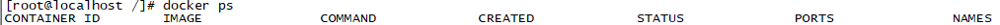
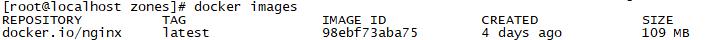

##### 安装docker
yum -y install docker

##### 启动docker服务
service docker start

##### 测试是否启动成功
docker -v

#### 镜像加速
docker配置:/etc/docker/daemon.json
1、阿里巴巴镜像源(这个是自己的)
   也可以配置网易云的镜像地址
2、配置docker 的域名解析
  {
  "registry-mirrors": ["http://hub-mirror.c.163.com"]，
  }
{
  "registry-mirrors": ["https://######.mirror.aliyuncs.com"],
  "insecure-registries":["###########"],
   "dns":["########"]
}

###docker基础命令
####容器基本命令
1.查看当前运行的容器
docker ps
2.查看所有的容器
docker ps -a

在查看容器时，涉及到几个查看参数，含义分别如下：
CONTAINER ID:CONTAINER ID是指容器的id，是一个唯一标识符,这是一个64位的十六进制整数，在不会混淆的情况下可以只采用id的前几位进行标识一个容器。
IMAGE:IMAGE表示创建容器时使用的镜像。
COMMAND:COMMAND表示容器最后运行的命令。
CREATED:创建容器的时间。
STATUS:容器的状态，这里可能显示一个容器启动时间，也能显示容器关闭时间。具体显示哪个要看容器当前的状态。
PORTS:容器对外开放的端口。
NAMES:容器的名字，如果不设置，会有一个默认的名字。
3.创建启动容器
创建容器有两种不同的方式，可以先创建，再启动，也可以创建启动一步到位，无论是那种方式，流程都是相似的，当执行一个创建命令之后，docker首先会去本地路径下查找是否有相应的镜像，如果没有，就去docker hub 上搜索，如果搜索到了，则下载下来，然后利用该镜像创建一个容器并启动。容器的文件系统是在只读的镜像文件上添加一层可读写的文件层，这样可以使在不改变镜像的情况下，只记录改变的数据。下面对这两种方式分别予以介绍。
a.创建容器,启动容器
假设创建一个nginx容器
docker create nginx (生成的容器的name是随机生成的)
docker create --name=nginx nginx (生成的容器的name为nginx)
启动
docker start id/name (id,name为容器的id,name值,后面遇到的都以此类推)
b.容器创建+启动
第一种为后台性容器
以nginx为例
docker run --name nginx1 -d -p 8080:80 nginx
--name 含义和上文一样，表示创建的容器的名字，-d 表示容器在后台运行，-p 表示将容器的 80 端口映射到宿主机的 8080 端口
第二种为交互性容器(这种方式不常用，这里就不多介绍了)
docker run --name ubuntu -it ubuntu /bin/bash
4.重启容器
docker restart id/name
5.停止容器
docker stop id/name
6.删除容器
docker rm id/name (只能删除已经停止的容器)
docker rm -f id/name (强制删除运行的容器)

####镜像基本命令
镜像是容器运行的基础，容器是镜像运行后的形态。
容器在启动或者创建时，必须指定一个镜像的名称或者 id ，其实，这时镜像所扮演的角色就是容器的模版，不同的镜像可以构造出不同的容器，同一个镜像，我们也可以通过配置不同参数来构造出不通的容器。
镜像的最底层是一个启动文件系统（bootfs）镜像，bootfs 的上层镜像叫做根镜像，一般来说，根镜像是一个操作系统，例如 Ubuntu、CentOS 等，用户的镜像必须构建于根镜像之上，在根镜像之上，用户可以构建出各种各样的其他镜像。
从上面的介绍读者可以看出，镜像的本质其实就是一系列文件的集合，一层套一层的结构有点类似于 Git ，也有点类似于生活中的洋葱。
1.查看镜像
docker images

这里一共有五个参数，含义分别如下：
TAG: TAG用于区分同一仓库中的不同镜像，默认为latest。
IMAGE ID: IMAGE ID是镜像的一个唯一标识符。
CREATED: CREATED表示镜像的创建时间。
SIZE: SIZE表示镜像的大小。
REPOSITORY:仓库名称，仓库一般用来存放同一类型的镜像。仓库的名称由其创建者指定。如果没有指定则为 <none> 。
2.查询镜像：
docker search images
3.下载镜像
docker pull mysql:5.2
4.删除镜像
如果有容器依赖此镜像，需要将相关的容器都删除，才可以删除镜像。
docker rmi id/name 
5.运行镜像产生容器
docker run --name mycentos -it 61818b708e23 /bin/bash
6.进入容器的常用两种方式
第一种 docker attach 
docker attach  id/name 
第二种 docker exec
docker exec -it id/name /bin/bash
7.退出并停止容器
exit
8.退出但不停止容器
ctrl+P+Q

####本地自定义镜像的创建
我们需要的是一个基础镜像，然后创建不同的容器，根据不同的容器，打成各种适合的镜像，
便于实施部署。(一种为commit，一种为build)
1.拉取一个基础镜像。例如linux，centos，redhat等
2.运行镜像，创建一个基础的容器。
3.拷贝文件到容器
docker cp /home/test/simplespringboot.jar 94b564fa9d2d:/root/
(从容器中拷贝文件出来)
docker cp 94b564fa9d2d:/root/simplespringboot.jar /home/test/
4.容器生成镜像
docker commit -m "测试容器生成镜像" -a "lgw" 94b564fa9d2d lgw/centos7:1.0
-m为注释，-a为作者，然后为镜像的id，最后为仓库名
5.备份镜像
docker save 61818b708e23 -o mycentos.tar mycentos:1.0
6.载入镜像
docker load -i mycentos.tar
7.给镜像重新分配名称和版本
docker tag 61818b708e23 mycentos:1.0
8.启动容器添加卷(先是本机文件)
docker run -it -p 12345:8080  -v /root/dockerdata:/data fa43ef971ae8
9.一个完整的启动容器例子
docker run -it -p 12345:8080 --name test1 -v /root/dockerdata/:/data -v /root/newdockerdata/:/newdata fa43ef971ae8

#####bulid镜像 依赖Dockerfile文件
10.构建镜像
docker build -t demo:1.0 .
注意文件名是Dockerfile ，add里面使用相对路径

11.进入镜像
docker attach monitor
docker exec -it monitor /bin/bash  --推荐这一种，java项目如果是前台启动，前一种进去会卡住

12.查看docker的日志 
docker logs -f -t --tail 100 datacenter

13.docker 私服登陆/登出
docker login -u ###### -p 123456 ##.##.##.##:12124
docker logout

14.上传到私服
docker push ##.##.##.##:12124/bizteam/analysisweb:1.0-SNAPSHOT

15.docker 部署方式启动容器
docker stack deploy -c docker-stack-ccp.yml ccp --resolve-image=never  --with-registry-auth

16.删除tag为none的镜像
docker images|grep none|awk '{print $3}'|xargs docker rmi

docker页面操作portainer.io
http://127.0.0.1:65000/#/stacks
admin/password
